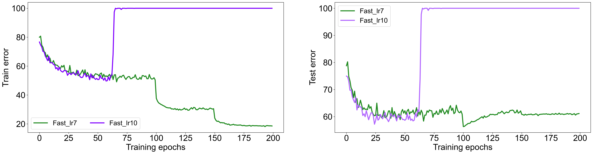

# Anonymous Project

This repository provides an official implementation of a paper that under double-blind review. The repository will be de-anonymized and released to the public after the review process.


## Getting started

To adversarially train a ResNet-18 model against $L_2$-norm attack by the free-AT algorithm, run: 
```
python train.py   --data cifar10  --method free  --attack L2  --eps 128.0  --model res18  --save_path cifar10_l2_free
```

To evaluate the model against [AutoAttack](https://github.com/fra31/auto-attack), run: 
```
python test_autoattack.py  --model_path cifar10_l2_free  --data cifar10  --attack L2  --eps 128.0  --seed 1 
```


## Catastrophic overfitting in Fast AT

We run Fast AT with attack step size $10/255$ for 200 training epochs. The training curve is plotted in the following figure. We note that Fast AT with attack step size $10/255$ encounters catastrophic overfitting over the course of 200 training epochs and it has almost zero robustness against PGD perturbations at the end of training.




## Performance Comparison
You can download the pretrained models in this [anonymous Google drive link](https://drive.google.com/drive/folders/18so78-vONvd6lZqLs26IwnaAXxfN1BvR?usp=drive_link). The outputs are saved in `model_pth/MODEL_NAME/test_autoattack_output.log`, and it can be reproduced by setting random seed as 1. 

### Robust accuracy of ResNet-18 models against AutoAttack

| CIFAR-10, $L_2$-norm Attack | Vanilla | Fast | Free | 
| ------ | ------ | ----- | ---- | 
| Train Accuracy (%) | 100.0 | 87.1 | 87.0 | 
| Test Accuracy (%) | 64.9 | 57.5 | 64.9 | 
| Generalization Gap (%) | 35.1 | 29.6 | 22.1 | 


| CIFAR-10, $L_\infty$-norm Attack | Vanilla | Fast | Free | 
| ------ | ------ | ----- | ---- | 
| Train Accuracy (%) | 89.1 | 54.4 | 57.4 | 
| Test Accuracy (%) | 40.7 | 31.0 | 42.3 | 
| Generalization Gap (%) | 48.4 | 23.4 | 15.1 | 


### Robust accuracy of WideResNet-34-10 models against AutoAttack


| CIFAR-10, $L_2$-norm Attack | Vanilla | Fast | Free | 
| ------ | ------ | ----- | ---- | 
| Train Accuracy (%) | $100.0 \pm 0.0$ | $99.7 \pm 0.1$ | $83.9 \pm 1.9$ | 
| Test Accuracy (%) | $68.5 \pm 1.9$ | $65.8 \pm 1.2$ | $67.0 \pm 0.9$ | 
| Generalization Gap (%) | $31.5 \pm 1.9$ | $33.9 \pm 1.3$ | $16.9 \pm 2.5$ | 


| CIFAR-10, $L_\infty$-norm Attack | Vanilla | Fast | Free | 
| ------ | ------ | ----- | ---- | 
| Train Accuracy (%) | $99.2 \pm 0.3$ | $66.7 \pm 0.6$ | $61.1 \pm 1.7$ | 
| Test Accuracy (%) | $44.5 \pm 1.3$ | $37.4 \pm 1.8$ | $48.3 \pm 2.7$ | 
| Generalization Gap (%) | $54.7 \pm 1.5$ | $29.4 \pm 2.0$ | $12.9 \pm 2.7$ | 
